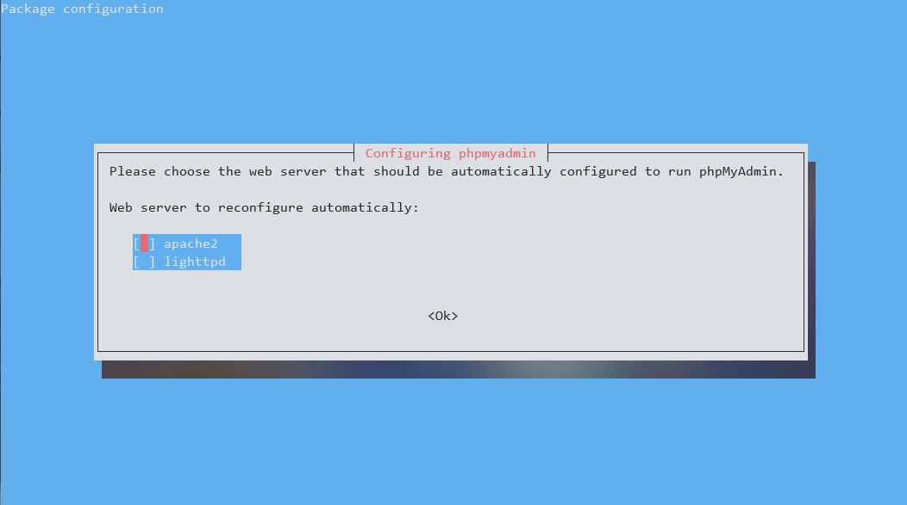
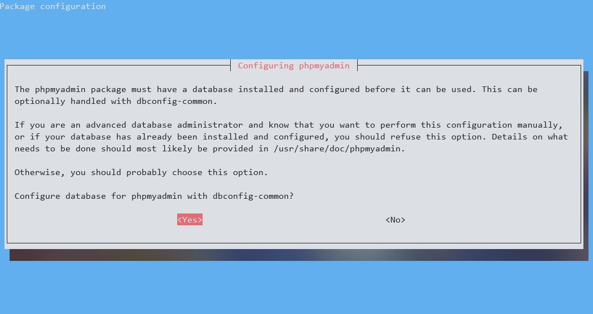
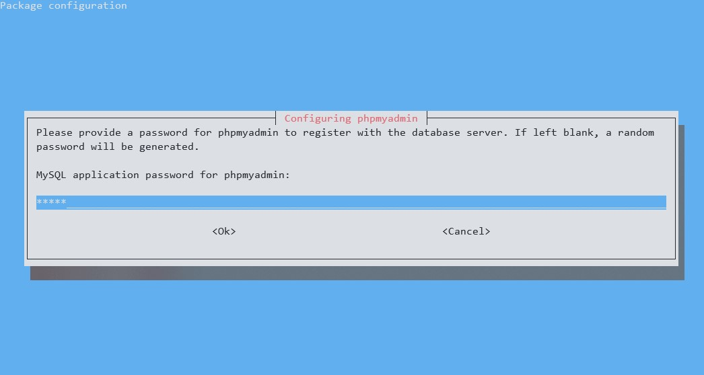

# WSL Debian localhost

Project purpose is to help with creating local Apache web server with PHP and MariaDB database.

## Getting Started

These instructions will get you a copy of the project up and running on your local machine for development purposes. 

### Prerequisites

What things you need to install the software and how to install them

* [Windows Subsystem for Linux](https://docs.microsoft.com/en-us/windows/wsl/install-win10)
* [Debian linux from Microsoft Store](https://www.microsoft.com/pl-pl/p/debian/9msvkqc78pk6)

**Be sure to use WSL 1!**

### Installing

A step by step how to install WDL

Update packages list, upgrade packages and install git

```shell
sudo apt update && sudo apt upgrade -y && sudo apt install -y git
```

Then clone repo

```shell
cd ~ && git clone https://github.com/Niyabi/WDL.git && chmod +x ./wdl.sh
```

Then let's run script which will install required packages and configure them. 

```shell
sudo ~/WDL/wdl.sh
```

At The end phpMyAdmin installer will ask few things. 

When asked about web server check (using *Spacebar*) *apache2* then hit *Enter*. 



When asked if to configure database check *Yes*.



The last thing is you will be asked to set password for phpmyadmin user.



### How to use

To start web server run start.sh:
```shell
sudo sh ~/WDL/start.sh
```

To stop web server run stop.sh:
```shell
sudo sh ~/WDL/stop.sh
```

To create virtual host run virtual-host.sh. You will be asked for project name and path to project, eg *myproject* in */mnt/c/Users/YourUserName/Documents/myproject* so your URL will be myproject.local:
```shell
sudo sh ~/WDL/virtual-host.sh
```

To connect to virtual host open Notepad as administrator, open hosts file in *C:\Windows\System32\drivers\etc*. Type localhost IP adress (*127.0.0.1*) and project URL e.g. *127.0.0.1 myproject.local*. Save and close file.

To access database use use HeidiSQL or phpMyAdmin (*http://localhost/phpmyadmin/*). To login to phpMyAdmin (if not asked for username during phpMyAdmin installation) username will be *phpmyadmin* and password the one you set during installation.

## Notes

### Install different version of PHP

This configuration allows use of mutiple version of PHP at the same time. To install different, than 7.2, version of PHP run this command:
```shell
sudo apt install -y phpX.Y phpX.Y-fpm
```

where X.Y is PHP version.

For example:
```shell
sudo apt install -y php7.0 php7.0-fpm
```

### Install PHP extension

To install PHP extension run:
```shell
sudo apt install -y phpX.Y-ext
```

where X.Y is PHP version.

For example:
```shell
sudo apt install -y php7.0-pdo
```

### Change PHP version for virtual host

In virtual host config file (found here: */etc/apache2/sites-available/*) you have to change php-fpm sock in this line:
```apache
SetHandler "proxy:unix:/var/run/php/php7.2-fpm.sock|fcgi://localhost/"
```

For example:
```apache
SetHandler "proxy:unix:/var/run/php/php7.0-fpm.sock|fcgi://localhost/"
```

## TODO

* Apache optimization
* MariaDB optimization
* PHP optimization

## Author

**Szymon Krawiec** - [Niyabi](https://github.com/Niyabi)

## License

This project is licensed under the GNU GPL v3 License - see the [LICENSE.md](LICENSE.md) file for details